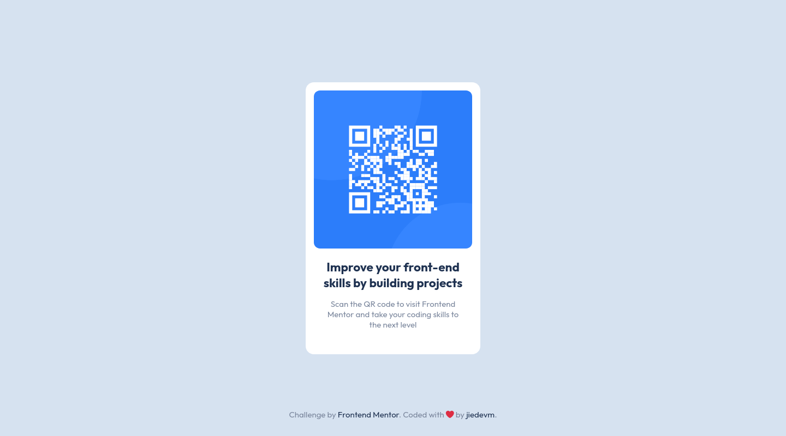

# Frontend Mentor - QR code component solution

This is a solution to the [QR code component challenge on Frontend Mentor](https://www.frontendmentor.io/challenges/qr-code-component-iux_sIO_H). Frontend Mentor challenges help you improve your coding skills by building realistic projects.


## Table of contents

-   [Overview](#overview)
    -   [The challenge](#the-challenge)
    -   [Screenshot](#screenshot)
    -   [Links](#links)
-   [My process](#my-process)
    -   [Built with](#built-with)
    -   [What I learned](#what-i-learned)
-   [Author](#author)

## Overview

### The challenge

Users should be able to:

-   View the optimal layout depending on their device's screen size
-   See hover states for interactive elements

### Screenshot



### Links

-   Solution URL: [https://github.com/dieudonneallognon/qr-code-component](https://github.com/dieudonneallognon/qr-code-component)
-   Live Site URL: [https://dieudonneallognon.github.io/qr-code-component/](https://dieudonneallognon.github.io/qr-code-component/)

## My process

### Built with

-   Semantic HTML5 markup
-   CSS custom properties
-   Flexbox
-   [Less](https://lesscss.org/) CSS Precompiler
-   [Gulp](https://gulpjs.com/) task Manager
-   [BEM](http://getbem.com/introduction/) Naming syntax
-   Desktop-first workflow

### What I learned

-   [BEM](https://lesscss.org/) Naming syntax

Aiming to gain more consistency and readability in my css code, I adopted the
BEM naming syntax for my css classes.

```html
<main class="card">
  
  <div class="card__content">
    <h1 class="card__content__title"> ...</h1>
    <p class="card__content__text">...</p>
  </div>
</main>

```

## Author

-   Github - [dieudonneallognon](https://github.com/dieudonneallognon/)
-   Frontend Mentor - [@dieudonneallognon](https://www.frontendmentor.io/profile/dieudonneallognon)
-   LinkedIn - [Dieudonné
    ALLOGNON](https://www.linkedin.com/in/dieudonn%C3%A9-allognon-200239175/)
